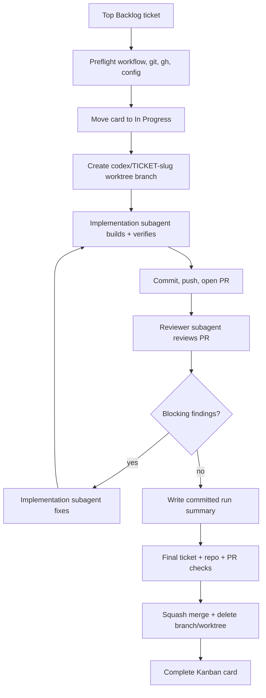

# Full E2E Merge Agent Loop

This loop turns the top ready Backlog ticket into a reviewed, verified, merged
pull request. It is designed for repositories that already use
`setup-project-workflow`.

The project-local source of truth remains:

- `AGENTS.md` for repo-local agent guidance.
- `docs/agents/project-workflow.json` for workflow configuration.
- the Obsidian Kanban board for visible ticket state.
- `docs/plans/*.md` for durable ticket plans and completion notes.

GitHub pull requests are the code review and merge vehicle. They are not the
ticket intake queue.

## Loop Diagram

## Operating Contract

One loop run owns one ticket, one branch, one pull request, one reviewer pass
sequence, and one committed summary.

The controller must select the top card in the `Backlog` lane. If that card is
not tagged `#ready-for-agent`, or if it lacks ticket-specific TODO,
Acceptance Criteria, or Verification items, stop and report the blocker. Do not
skip to a lower Backlog card.

Before implementation, the controller must read the Kanban card and linked plan.
If they conflict on scope, acceptance criteria, or verification, stop and ask
for the ticket to be corrected.

The implementation subagent works in an isolated ticket worktree and branch
named from `loop-config.json`, defaulting to `codex/{ticketId}-{slug}`.

The reviewer subagent reviews the pull request against the ticket, linked plan,
and repo instructions. Its default scope is spec plus standards: bugs,
regressions, missing tests, stale verification, and workflow closeout gaps.

The agent may squash merge only after every green gate is satisfied after the
last commit.

## Preflight Gate

Stop before changing implementation files unless all of these are true:

- `AGENTS.md` exists.
- `docs/agents/project-workflow.json` exists and parses.
- `docs/agents/ticket-workflow.md` exists.
- `docs/agents/issue-tracker.md` exists.
- `.env` or the project environment defines the vault root named by
  `project-workflow.json`.
- the Obsidian Kanban board can be located and read.
- the top Backlog card is `#ready-for-agent`.
- the top Backlog card links to a plan under `docs/plans/`.
- the target checkout is clean except for explicitly allowed loop state.
- `gh` is installed and authenticated before any PR or merge step.
- the base branch is available locally and remotely.

If any preflight item fails, record the blocker and leave the card out of
`Completed`.

## Implementation Gate

The implementation subagent must:

- read the card, linked plan, `AGENTS.md`, and relevant repo docs before editing.
- identify the test seam before changing behavior.
- make scoped changes for this ticket only.
- update or add tests for behavior changes.
- run ticket verification items and focused checks while working.
- run the fullest practical repo check before commit.
- run a changed-file secret scan before PR creation.
- leave a concise implementation summary for the run summary and PR body.

If verification fails, the subagent may repair and retry up to the configured
limit. The default is 3 attempts. After the limit, stop the loop and record the
failure.

## Review Gate

The reviewer subagent must inspect the PR diff and the ticket context. Findings
must be classified as blocking or nonblocking.

Blocking findings include:

- acceptance criteria not satisfied.
- verification evidence missing, stale, or run before the final commit.
- likely bugs or regressions.
- missing required tests for behavior changes.
- violation of repo-local instructions.
- ticket closeout steps skipped or contradicted.
- potential secret leakage in changed files.

Nonblocking findings can be recorded in the PR and summary without blocking
merge.

The implementation subagent may address blocking findings and rerun checks up to
the configured review-fix cycle limit. The default is 3 cycles. After the limit,
stop the loop and record unresolved findings.

## Green Gate

The branch is green only when all required evidence is current after the last
commit:

- all ticket acceptance criteria are satisfied.
- all ticket verification items passed or were explicitly marked not applicable
  with a reason.
- focused and full practical repo checks passed.
- changed-file secret scan passed.
- GitHub PR checks passed when configured.
- if no GitHub PR checks exist, the PR body and run summary explicitly say
  remote checks were not configured.
- reviewer has no unresolved blocking findings.
- the committed run summary is present.
- the branch is up to date with the base branch, or has been rebased and all
  checks rerun.

## Merge And Closeout

When green, the controller may:

1. Squash merge the pull request.
2. Delete the remote branch when supported.
3. Delete the local ticket branch and worktree.
4. Append final completion notes to the linked plan.
5. Move the Kanban card to `Completed` with `--complete`.
6. Check applicable TODO, Acceptance Criteria, and Verification boxes on the
   card.
7. Re-read the board and confirm the card is in `Completed`.

The committed run summary records pre-merge evidence. The final merge result is
recorded in the pull request and Kanban completion note.

## Project Config

The machine-readable policy lives in
`docs/agent-loops/full-e2e-merge/loop-config.json`.

| Field | Meaning |
| --- | --- |
| `paths.*` | Project-local docs, plan, prompt, and run-record paths. |
| `ticketSelection.strategy` | `top-card-only`; the loop never skips the top Backlog card. |
| `ticketSelection.requiredTriageTag` | The tag required to begin work, default `#ready-for-agent`. |
| `agents.model` | Default agent model is ephemeral subagents, not durable project threads. |
| `branching.branchNameTemplate` | Branch naming policy, default `codex/{ticketId}-{slug}`. |
| `limits.*` | Per-project retry limits, defaulting to 3. |
| `checks.*` | Required verification gates. |
| `merge.*` | Merge authority, method, base drift, and cleanup policy. |
| `failurePolicy.*` | Stop conditions and blocked-run behavior. |
| `records.*` | Committed summary and ignored raw-log policy. |

## Raw Logs And Summaries

For ticket `ABC-0001`, the default record paths are:

- committed summary:
  `docs/agent-loops/full-e2e-merge/runs/ABC-0001/summary.md`
- ignored raw logs:
  `docs/agent-loops/full-e2e-merge/runs/ABC-0001/raw/`

Commit concise summaries. Do not commit raw subagent transcripts, command logs,
or sensitive local environment output.
