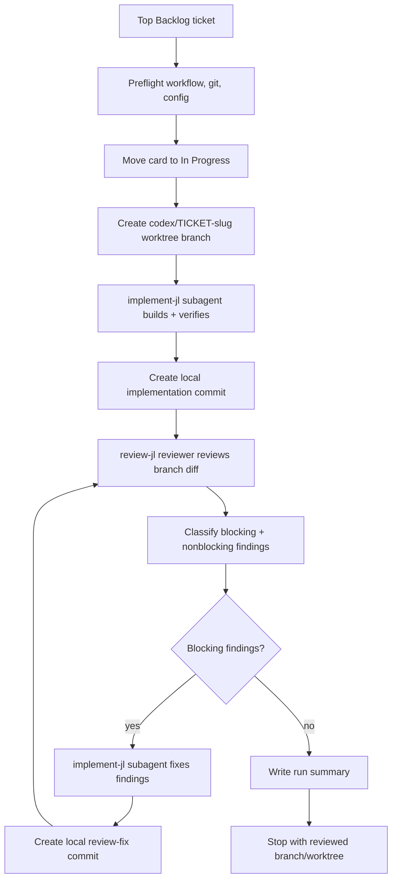

# implement-then-review Agent Loop

This loop turns the top ready Backlog ticket into an implemented branch with a
`review-jl` review result. It is designed for repositories that already use
`setup-project-workflow`.

The project-local source of truth remains:

- `AGENTS.md` for repo-local agent guidance.
- `docs/agents/project-workflow.json` for workflow configuration.
- the Obsidian Kanban board for visible ticket state.
- `docs/plans/*.md` for durable ticket plans and completion notes.

This loop is intentionally smaller than `full-e2e-merge`: it implements through
`implement-jl`, reviews through `review-jl`, routes blocking findings through
bounded review-fix cycles, and stops with a reviewed branch or a blocked run.
It does not open a pull request,
merge, or complete the Kanban card.

## Loop Diagram

## Operating Contract

One loop run owns one ticket, one branch, one worktree, one implementation
sequence, one or more local implementation commits, one `review-jl` sequence,
bounded review-fix cycles, and one summary.

The controller must select the top card in the `Backlog` lane. If that card is
not tagged `#ready-for-agent`, or if it lacks ticket-specific TODO,
Acceptance Criteria, or Verification items, stop and report the blocker. Do not
skip to a lower Backlog card.

Before implementation, the controller must read the Kanban card and linked plan.
If they conflict on scope, acceptance criteria, or verification, stop and ask
for the ticket to be corrected.

The implementation subagent works in an isolated ticket worktree and branch
named from `loop-config.json`, defaulting to `codex/{ticketId}-{slug}`. It uses
the configured `agents.implementationSkill`, defaulting to `implement-jl`.

The reviewer reviews the branch diff against the configured base branch, the
ticket, the linked plan, and repo instructions. It uses the configured
`agents.reviewSkill`, defaulting to `review-jl`; that skill owns the
Thermos-backed review workflow and synthesized findings-first result.

Blocking findings are returned to the implementation subagent while configured
review-fix cycles remain. If the reviewer still returns blocking findings after
the limit, the controller stops with `unresolved-blocking-review-findings`. A
human or a later loop decides whether to open a PR, merge, or close the ticket.

## Preflight Gate

Stop before changing implementation files unless all of these are true:

- `AGENTS.md` exists.
- `docs/agents/project-workflow.json` exists and parses.
- `docs/agents/ticket-workflow.md` exists.
- `docs/agents/issue-tracker.md` exists.
- `.env` or the project environment defines the vault root named by
  `project-workflow.json`.
- the Obsidian Kanban board can be located and read.
- the top Backlog card is `#ready-for-agent`.
- the top Backlog card links to a plan under `docs/plans/`.
- the target checkout is clean except for explicitly allowed loop state.
- the base branch is available locally.

If any preflight item fails, record the blocker and leave the card out of
`Completed`.

## Implementation Gate

The implementation subagent must:

- read the card, linked plan, `AGENTS.md`, and relevant repo docs before
  editing.
- identify the test seam before changing behavior.
- make scoped changes for this ticket only.
- update or add tests for behavior changes.
- run ticket verification items and focused checks while working.
- run the fullest practical repo check before returning.
- run a changed-file secret scan or explicit changed-file secret review.
- make sure all evidence is from after the final implementation change.
- leave a concise implementation summary for the run summary.

If verification fails, the subagent may repair and retry up to the configured
limit. The default is 3 attempts. After the limit, stop the loop and record the
failure.

After the implementation gate passes, the controller creates a local
implementation commit so the review target is a stable diff against the base
branch. The loop does not push this commit.

During review-fix cycles, the implementation subagent must address only the
blocking findings and directly required follow-up changes. It must rerun
relevant ticket verification, focused checks, the fullest practical repo check,
and changed-file secret scan/review after the final review-fix change before
returning `ready`.

## Review Gate

The `review-jl` reviewer must inspect the branch diff and ticket context.
Findings must be classified as blocking or nonblocking for the controller.
The reviewer must follow the `review-jl` workflow rather than bypassing it with
lower-level review skills.

Blocking findings include:

- acceptance criteria not satisfied.
- verification evidence missing, stale, or run before the final change.
- likely bugs, regressions, security issues, or feature leaks.
- missing required tests for behavior changes.
- violation of repo-local instructions.
- potential secret leakage in changed files.
- structural code-quality regressions that should not proceed without cleanup.

Nonblocking findings can be recorded in the summary without blocking the review
result.

Blocking findings are sent back to the implementation subagent until either:

- the reviewer returns zero blocking findings, or
- `limits.reviewFixCycles` is exhausted.

The reviewer does not rewrite the implementation, open a pull request, merge, or
complete the Kanban card.

## Terminal Gate

The loop has reached its intended terminal state when:

- implementation completed in the isolated branch/worktree.
- ticket verification items passed or were explicitly marked not applicable
  with a reason.
- focused and full practical repo checks passed.
- changed-file secret scan/review passed.
- a local implementation commit exists.
- `review-jl` completed and returned zero blocking findings.
- the run summary records the implementation, verification, and review result.

The terminal status is `reviewed` only when `review-jl` returns zero blocking
findings. If blocking findings remain after the review-fix limit, the loop stops
as `blocked` with `unresolved-blocking-review-findings`.

## Handoff

After review, the controller stops with:

- the branch and worktree left in place.
- the Kanban card left out of `Completed`.
- the run summary written under
  `docs/agent-loops/implement-then-review/runs/<ticket-id>/summary.md`.
- raw logs kept under
  `docs/agent-loops/implement-then-review/runs/<ticket-id>/raw/` and ignored.
- a clear next-action note: open a PR, hand off to another loop, or stop for
  human input after review passes; fix unresolved findings when the loop blocks.

## Loop Config

The canonical machine-readable policy lives in
`loops/implement-then-review/loop-config.json` in the reference repo.
Target-project values live in
`docs/agent-loops/implement-then-review/loop-config.json` and override equally
named canonical values.

| Field | Meaning |
| --- | --- |
| `paths.*` | Project-local workflow docs, marker files, and run-record paths. |
| `ticketSelection.strategy` | `top-card-only`; the loop never skips the top Backlog card. |
| `agents.implementationSkill` | Implementation skill used by the implementation subagent; default `implement-jl`. |
| `agents.reviewSkill` | Review skill used by the reviewer subagent; default `review-jl`. |
| `branching.branchNameTemplate` | Branch naming policy, default `codex/{ticketId}-{slug}`. |
| `limits.verificationRepairAttempts` | Initial implementation verification retry budget. |
| `limits.reviewFixCycles` | Blocking review finding repair budget. |
| `checks.*` | Required implementation verification gates. |
| `review.*` | Stable diff review target and bounded review-fix policy. |
| `handoff.*` | Explicitly disables PR creation, merge, and Kanban completion. |
| `failurePolicy.*` | Stop conditions and blocked-run behavior. |
| `records.*` | Summary and raw-log policy. |
